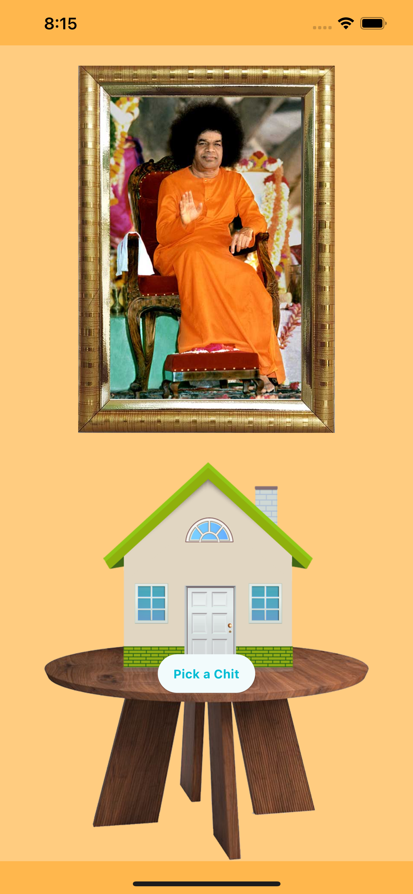
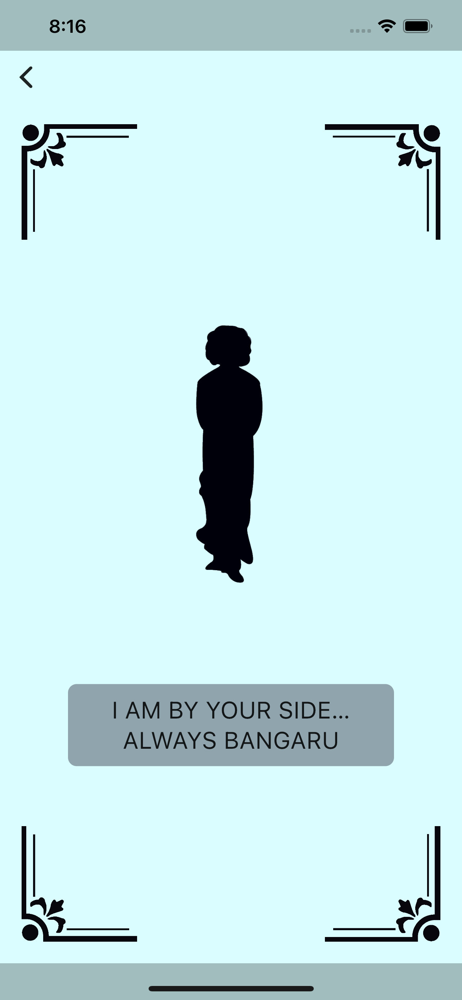

    

<h1 align="center">Sai Chits</h1>

    Pray to Sai and pick a chit to see what he says

  
  

<!-- TODO: add GitHub Play and App Store -->

  

 

## What this app does

This application has only one function. It lists a possible message that the Lord (Bhagawan Sri Sathya Sai Baba) wishes to tell. You have to keep or ask a question to the Lord and click on the button "Pick a Chit". And when clicking it, appears the message from the Lord. It is advised not to keep pressing or picking the chit very often and to use it only when needed.

## Motivation

Students from Sri Sathya Sai Institutions have a place to go when a student feels low or is in a situation where they want to talk to swami. There is a chit box arranged, and the student, while thinking of swami or asking swami something, picks the chit and blindly follows it.

From the very same scenario, I have tried to digitalize it into an application and make it available not only to Swami Students but all around the globe.

You might wonder that there is already an application called "Talk to Swami". This application is different in the following ways:
The data collected is not from only one campus but two campuses - "Brindavan" and "Prasanthi Nilayam". Also, the application look and feel are similar to how it is arranged in the hostels of the institutions (having a swami photo on the wall, then a chit house to pick the chit).
This application supports more than one platform and is accessible to everyone even without installing the application.
The application is simple and does only one job well.

## Contribution

If there are any more chits from other campuses named "Anantapur", "Muddenahalli", etc. campuses, please send them to me at [mail@immadisairaj.dev](mail+saichits@immadisairaj.dev) with a proper subject. Or, you can even open a pull request into the file [lib/chits.dart](https://github.com/immadisairaj/sai_chits/blob/main/lib/chits.dart).

## Screenshots

   

## Privacy Policy

The Privacy Policy of the app is in the site: [https://saichits.immadisairaj.dev/privacy_policy.html](https://saichits.immadisairaj.dev/privacy_policy.html)

## License

The project is licensed under the MIT License, see the [LICENSE.md](https://github.com/immadisairaj/sai_chits/blob/main/LICENSE.md) for more details
